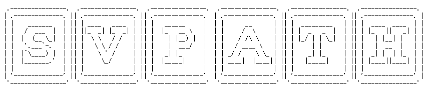

# SVPath Documentation
SVPath is used to predict the pathogenicity of human exon structural variations. SVPath is based on the Gradient Boosting Decision Tree (GBDT) machine learning method. The training data comes from ClinVar (https://www.ncbi.nlm.nih.gov/clinvar/) and dbVar (https://www.ncbi.nlm.nih.gov/dbvar/) (based on the hg19 reference genome). By integrating various feature data, SVPath realizes the pathogenicity prediction of deletion, insertion and duplication structural variations on exon.


## Publication
Yang, Y., Wang, X., Zhou, D., Wei, D. Q., & Peng, S. (2022). SVPath: an accurate pipeline for predicting the pathogenicity of human exon structural variants. Briefings in Bioinformatics.


## Data preparation
Because SVPath requires more external data, some smaller files are already included in the corresponding directories. We provide a way to download larger files in the ```download.sh``` file, just run the following command to download:
```
sh download.sh
```
Here, for the download of CADD, revel, dbNSFP and MCAP, we use the download method of ANNOVAR and get the files in txt format. Due to the large size of these files, they are all read line by line during operation, so it will take a lot of time. Therefore, we split these large files to speed up the running speed. The file splitting is through:
```
sh split.sh path/to/reference.fa
```
The hg19 reference can be downloaded from https://hgdownload.cse.ucsc.edu/goldenPath/hg19/chromosomes/
## Requirements
SVPath runs on a Linux system and requires the following software packages:
* python 3.6
* bedtools (see https://bedtools.readthedocs.io/en/latest/content/installation.html)

Python packages include:
- PyVCF 0.6.8
- pyBigWig 0.3.18
- numpy  1.19.5
- pysam  0.15.4
- scikit-learn 0.24.0
- pandas 1.1.5
- prettytable 2.4.0

## Run SVPath
### Pre-training
We provide the feature data when training the models in the ```saved_models``` path, which can directly train the pathogenicity prediction models of these three structural variants, such as:
```
cd saved_models
python training.py -i ./del_features.csv -o . -t DEL
```
### Pre-treatment
The input of SVPath is a standard VCF file, and this file contains only one structural variation, namely deletion, insertion or duplication. For example ```example/deletion.vcf```. We need to annotate it with the ANNOVAR variant annotation tool. (ANNOVAR was developed by Wang et al., see https://annovar.openbioinformatics.org/en/latest/ or https://github.com/WGLab/doc-ANNOVAR) (Wang K, Li M, Hakonarson H. ANNOVAR: Functional annotation of genetic variants from next-generation sequencing data Nucleic Acids Research, 38:e164, 2010)
```
./annovar/table_annovar.pl example/deletion.vcf annovar/humandb/ -buildver hg19 -out DEL -remove -protocol refGene -operation g -nastring . -vcfinput
```
### Feature construction
```
python src/generate_features_del.py -i DEL.hg19_multianno.vcf -o del_features.csv \
      -R reference/hg19.fasta -p 8 -g data/gene -d data/dbnsfp -m data/mcap -r data/revel -c data/cadd \
      -b data/bigwig/28736.Roadmap.SRS004212_Combined_Libraries_424.WGB-Seq.signal.bigWig \
         data/bigwig/E003-DNase.pval.signal.bigwig \
         data/bigwig/E003-H3K27ac.pval.signal.bigwig \
         data/bigwig/E003-H3K27me3.pval.signal.bigwig \
         data/bigwig/E003-H3K36me3.pval.signal.bigwig \
         data/bigwig/E003-H3K4me1.pval.signal.bigwig \
         data/bigwig/E003-H3K4me3.pval.signal.bigwig \
         data/bigwig/E003-H3K9me3.pval.signal.bigwig \
         data/bigwig/E003_WGBS_FractionalMethylation.bigwig \
         data/bigwig/ENCFF225MAO.bigWig \
         data/bigwig/GSM923451_hg19_wgEncodeUwRepliSeqGm12878WaveSignalRep1.bigWig \
         data/bigwig/hg19.100way.phyloP100way.bw \
      -l data/bed/gc19_pc.3utr.nr.bed \
         data/bed/gc19_pc.5utr.nr.bed \
         data/bed/data/gc19_pc.cds.nr.bed \
         data/bed/gc19_pc.prom.nr.bed \
         data/bed/gc19_pc.ss.nr.bed \
         data/bed/H1-ESC_Dixon2015-raw_TADs.bed \
         data/bed/sensitive.nc.bed \
         data/bed/ultra.conserved.hg19.bed \
         data/bed/wgEncodeBroadHmmGm12878HMM.Heterochrom.bed
```
The meaning of the relevant parameters can be checked using ```python src/generate_features_del.py -h```, where the order of the files in the ```-b``` and ```-l``` options needs to be specified according to the example.
### Predicting
```
python src/predicting.py -i del_features.csv -m saved_models/DEL.pkl -o pred_results.csv
```
### If you have any questions or comments, please feel free to email:yangyn@hnu.edu.cn
